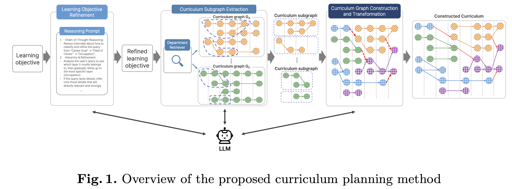

# Curriculum Planning for Independent Majors with Large Language Models
This repository contains the official code and datasets for the paper:
**"Curriculum Planning for Independent Majors with Large Language Models"**  
> Hyeon Jin*, Chaewon Yoon*, Hyun-Je Song  
> *Presented at International Conference on Artificial Intelligence in Education (AIED), Palermo, Italy* 

---

## Overview
Designing an optimal learning path is hard: learners must sift through hundreds of courses, untangle prerequisite chains, and choose the right mix of disciplines.  
**CurriculumPlan** tackles this problem by:

- **Expanding** a user‑provided learning goal into rich queries with an LLM.  
- **Retrieving** the most relevant departments and courses via dense embeddings.  
- **Building** a prerequisite graph to reveal feasible course sequences.  
- **Filtering & Refining** graph edges with an LLM for clarity and conciseness.  
- **Visualizing** the final curriculum so learners (and advisors) can grasp it at a glance.

<table align="center">
  <tr>
    <td align="center">
      
      <br>
      <em><strong>Figure&nbsp;1:</strong> End‑to‑end curriculum generation pipeline.</em>
    </td>
  </tr>
</table>

---

## Installation

```bash
git clone https://github.com/lluvecwonv/curriculumplan.git
cd curriculumplan
python3 -m venv .venv && source .venv/bin/activate
pip install -r requirements.txt
```

---
## Usage
Generate a curriculum

```bash
export OPENAI_API_KEY=sk-xxxxxxxxxxxxxxxxxx

python main.py \
  --openai_api_key $OPENAI_API_KEY \
  --query_prompt_path ./data/query_prompt.txt \
  --query_path ./data/sample_goals.json \
  --department_path ./data/depart_info.json \
  --db_config_path ./data/db.json \
  --prerequisite_path ./prerequisites/result_hyun_j \
  --save_path ./result \
  --query_exp          # enable LLM query expansion
  --top_k 3            # select top‑3 departments
```


---
